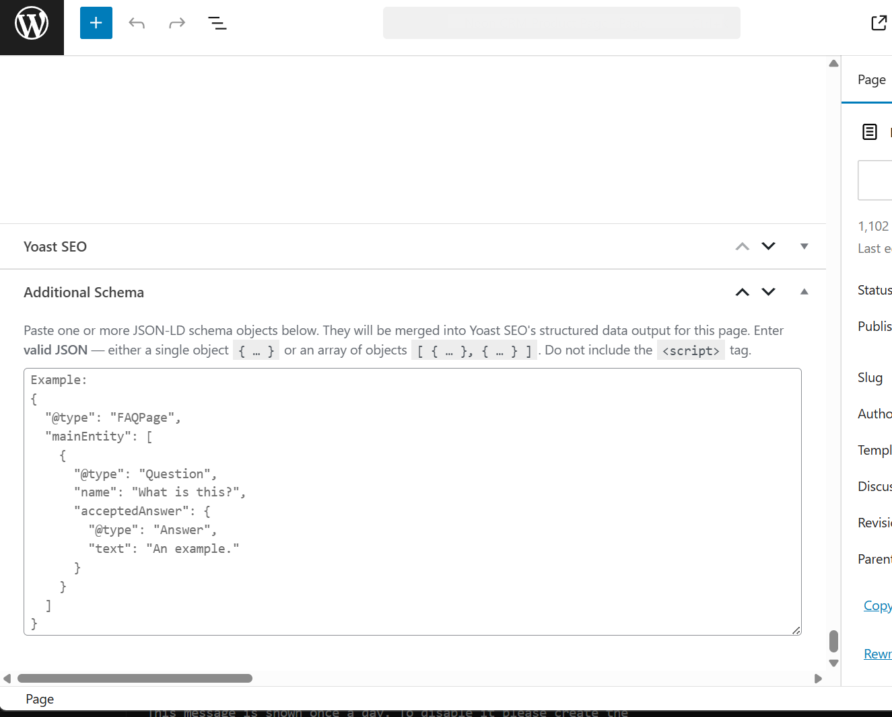

# Additional Schema for Yoast SEO

**Version:** 1.0.0

A simple WordPress plugin that accepts valid schema JSON and inserts it into the Yoast SEO schema markup output.

Obviously requires [Yoast SEO Plugin](https://wordpress.org/plugins/wordpress-seo/) be installed, active, and already outputting schema on your site.

---

## Screenshot

---

## Features

- Adds a metabox to all public post types to enable expanding the default Yoast SEO schema markup of the post

---

## Installation

1. Upload the plugin files to the `/wp-content/plugins/` directory, or install the plugin through the WordPress plugins screen directly.
2. Activate the plugin through the 'Plugins' screen in WordPress.
3. Add schema data to any post at the bottom in a new metabox

---

## Support

For questions, feedback, or issues, please seek somebody else. Use at your own risk, your mileage may vary.
